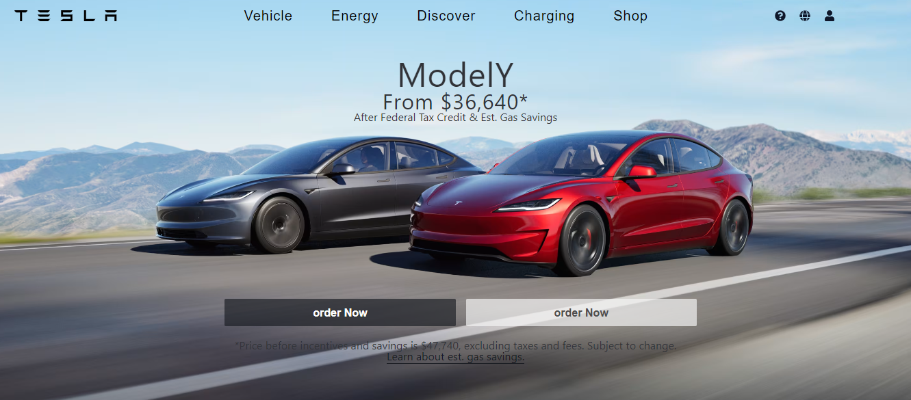

# Tesla Clone with Modern Menu

This project is a clone of the Tesla website, featuring a modern mega menu and reusable components for the homepage using React.js.

## Table of Contents

- [Features](#features)
- [Technologies Used](#technologies-used)

## Features

- Modern mega menu inspired by Tesla's website
- Reusable components for various sections of the homepage
- Responsive design for mobile and desktop views
- Smooth transitions and animations
- Sidebar navigation
- Dynamic content rendering
